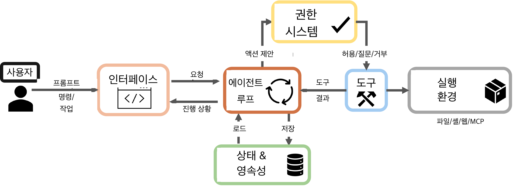
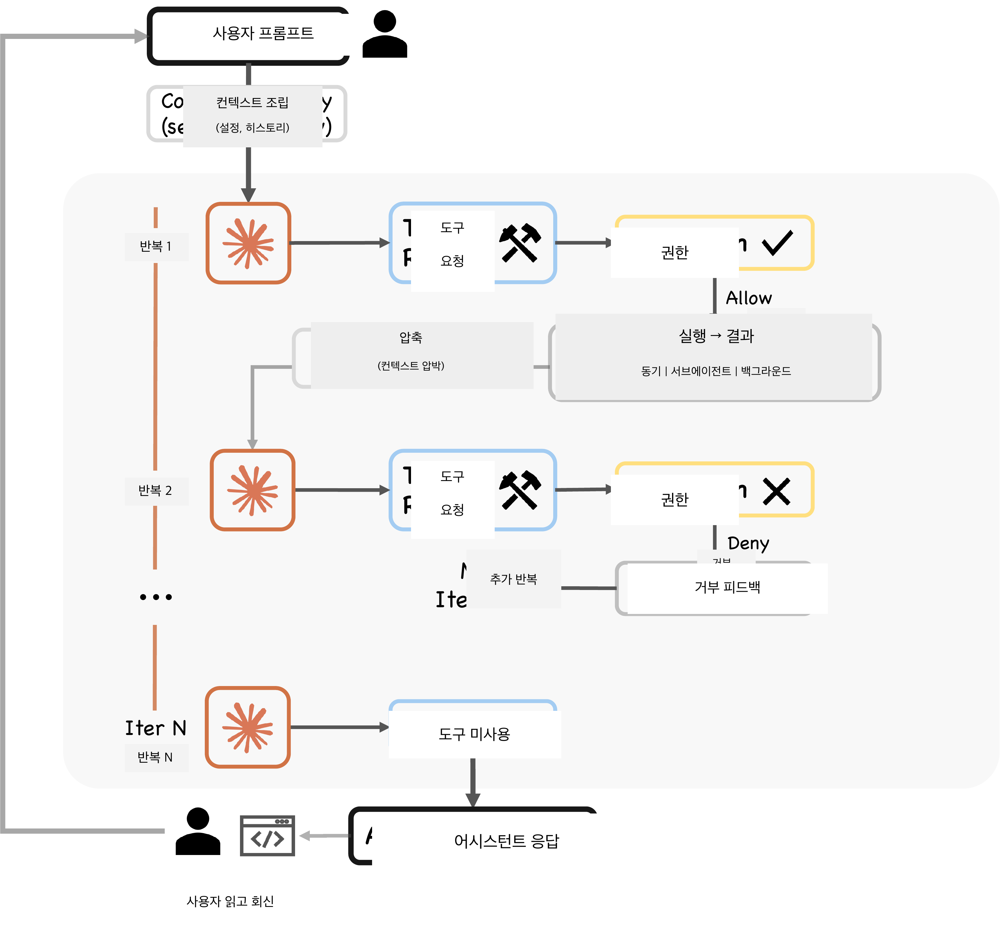
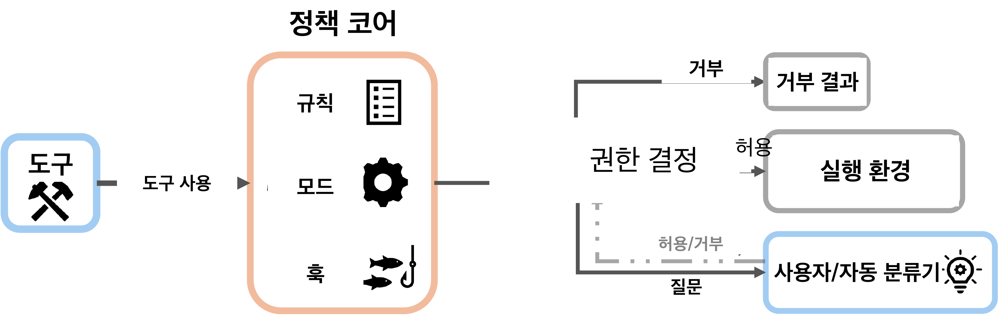
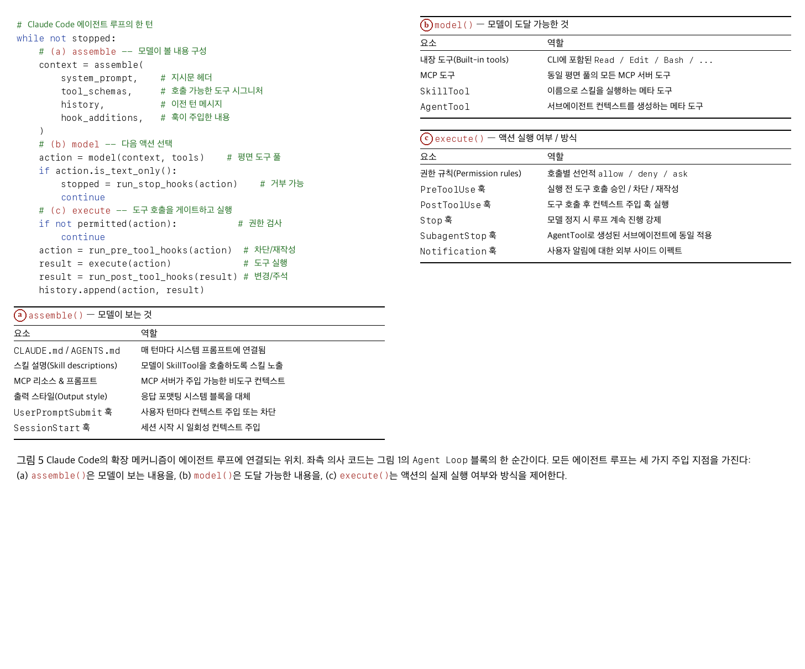
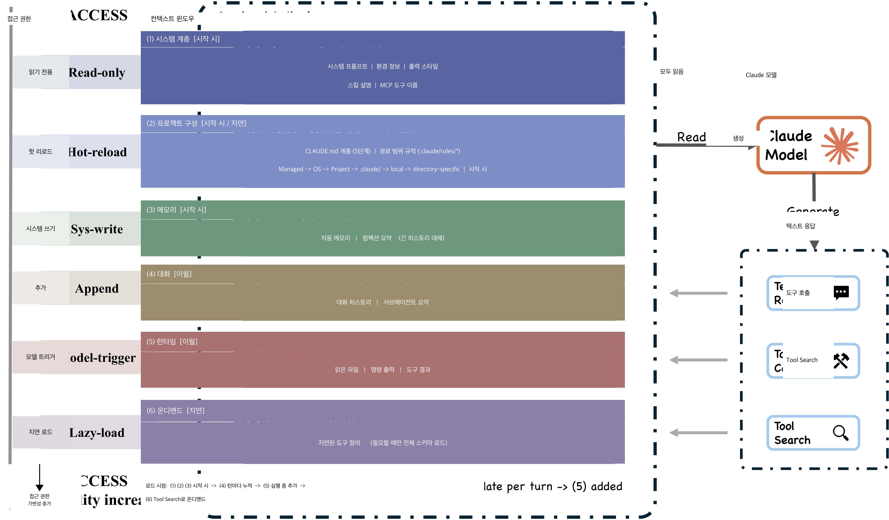
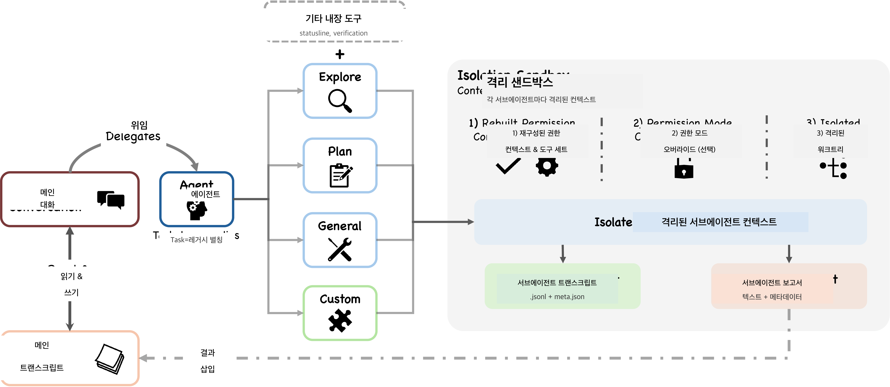
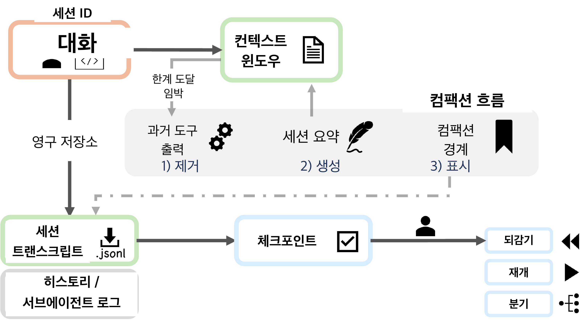

[메인 README로 돌아가기](../README_KR.md)

# 아키텍처 개요

> 핵심 에이전트 루프(agent loop)는 단순한 while 루프다. 대부분의 코드는 그 주변을 둘러싼 시스템에 있다.

## 모든 코딩 에이전트가 답해야 할 4가지 설계 질문

| 설계 질문 | Claude Code의 답 | 대안 |
|:----------------|:---------------------|:-------------|
| **추론(reasoning)은 어디에 있는가?** | 모델이 추론하고, 하네스(harness)가 강제한다. AI 의사결정 로직은 약 1.6%, 인프라가 98.4%. | LangGraph: 명시적 상태 그래프. Devin: 다단계 플래너. |
| **실행 엔진은 몇 개인가?** | 모든 인터페이스(CLI, SDK, IDE)에 단일 `queryLoop` 사용. | 표면(surface)별 모드 전용 엔진. |
| **기본 안전 자세는 무엇인가?** | 거부 우선(deny-first): deny > ask > allow. 가장 엄격한 규칙이 이긴다. | 컨테이너 격리(SWE-Agent), git 롤백(Aider). |
| **결정적 제약(binding constraint) 자원은 무엇인가?** | 약 200K 토큰의 컨텍스트 윈도우. 매 모델 호출 전에 5개의 컴팩션(compaction) 전략이 실행된다. | 컴퓨트 예산, 명시적 스크래치패드. |

## 시스템 상위 구조 (7개 컴포넌트)

  

1. **사용자(User)** -- 프롬프트 제출, 권한 승인, 결과 검토
2. **인터페이스(Interfaces)** -- 인터랙티브 CLI, 헤드리스 CLI(`claude -p`), Agent SDK, IDE/Desktop/Browser
3. **에이전트 루프(Agent Loop)** -- `query.ts`의 `queryLoop` async generator: 모델 호출 → 도구 디스패치 → 결과 수집 → 반복
4. **권한 시스템(Permission System)** -- 거부 우선 규칙 + 오토 모드 ML 분류기 + 훅(hook) 인터셉션
5. **도구(Tools)** -- 최대 54개의 빌트인 + MCP 제공 도구, `assembleToolPool`로 조립
6. **상태 및 영속성(State & Persistence)** -- 추가 전용(append-only) JSONL 트랜스크립트, 프롬프트 히스토리, 서브에이전트(subagent) 사이드체인(sidechain)
7. **실행 환경(Execution Environment)** -- 셸(샌드박스 포함), 파일시스템, 웹 페치, MCP 연결

> **[번역 주석]** MCP(Model Context Protocol)는 Anthropic이 제안한 외부 도구/리소스 연동 표준이다. CLI는 Command-Line Interface, SDK는 Software Development Kit를 의미한다.

모든 인터페이스는 동일한 `queryLoop`로 수렴한다. 인터랙티브 CLI, 헤드리스 모드, SDK, IDE 모두 같은 코드 경로를 공유한다. `QueryEngine`은 대화(conversation) 래퍼일 뿐, 엔진 자체가 아니다.

## 5계층 서브시스템 분해 (21개 서브시스템)

| 계층 | 책임 | 주요 컴포넌트 |
|:------|:---------------|:---------------|
| **Surface** | 진입점과 렌더링 | CLI, 헤드리스, SDK, IDE (React + Ink 터미널 UI) |
| **Core** | 컨텍스트 조립과 에이전트 루프 | `queryLoop`, 5단계 컴팩션 파이프라인, 서브에이전트 스폰 |
| **Safety/Action** | 권한과 도구 | 7개의 권한 모드, 오토 모드 분류기, 27개의 훅 이벤트, 도구 풀, 셸 샌드박스 |
| **State** | 런타임 상태와 영속성 | JSONL 트랜스크립트, CLAUDE.md 계층, 자동 메모리, 사이드체인 파일 |
| **Backend** | 실행 환경 | 셸 실행, MCP 연결(7가지 전송 타입), 42개의 도구 서브디렉터리 |

## 7개의 독립적인 안전 계층

요청은 적용 가능한 **모든** 계층을 통과해야 한다. 어느 한 계층이라도 차단할 수 있다.

1. **도구 사전 필터링(Tool pre-filtering)** -- 일괄 거부된 도구는 모델의 시야에서 완전히 제거된다
2. **거부 우선 규칙 평가** -- deny는 항상 allow보다 우선한다. allow가 더 구체적이라도 마찬가지다
3. **권한 모드 제약** -- 활성 모드가 기본 처리 방식을 결정한다
4. **오토 모드 ML 분류기** -- 별도의 LLM 호출이 안전성을 독립적으로 평가한다
5. **셸 샌드박싱(Shell sandboxing)** -- 셸 명령에 대한 파일시스템 + 네트워크 격리
6. **재개 시 비복원(Non-restoration on resume)** -- 권한은 세션 경계를 절대 넘어 유지되지 않는다
7. **훅 기반 인터셉션** -- PreToolUse 훅이 액션을 수정하거나 차단할 수 있다

## 턴(Turn) 실행: 9단계 파이프라인

  

각 턴은 **9단계 파이프라인**을 따른다.

1. 설정 해석 → 2. 상태 초기화 → 3. 컨텍스트 조립 → 4. 5개의 사전 모델 셰이퍼(shaper) → 5. 모델 호출 → 6. 도구 디스패치 → 7. 권한 게이트 → 8. 도구 실행 → 9. 종료 조건 확인

### 5개의 사전 모델 컨텍스트 셰이퍼

**모든 모델 호출 직전에 순차적으로** 실행되며, 비용이 낮은 것부터 적용된다.

| 단계 | 전략 | 트리거 |
|:------|:---------|:--------|
| Budget Reduction | 메시지별 크기 상한 | 항상 활성 |
| Snip | 오래된 히스토리 트리밍 | 피처 게이트(`HISTORY_SNIP`) |
| Microcompact | 캐시 인식 세분화 압축 | 항상(시간 기반) + 선택적 캐시 인식 경로 |
| Context Collapse | 읽기 시 가상 프로젝션(비파괴) | 피처 게이트(`CONTEXT_COLLAPSE`) |
| Auto-Compact | 모델이 생성하는 전체 요약(최후의 수단) | 다른 모든 방법이 실패했을 때 |

### 복구 메커니즘

- 최대 출력 토큰 escalation (턴당 최대 3회 재시도)
- 반응적 컴팩션(reactive compaction) (턴당 최대 1회 발생)
- prompt-too-long: context-collapse 오버플로 → 반응적 컴팩션 → 종료 순으로 시도
- 스트리밍 폴백 및 폴백 모델 전환

## 권한 시스템 심층 분석

  

### 7개의 권한 모드

| 모드 | 동작 | 신뢰 수준 |
|:-----|:---------|:------------|
| `plan` | 사용자가 실행 전 모든 계획을 승인 | 최저 |
| `default` | 표준 인터랙티브 승인 | 낮음 |
| `acceptEdits` | 파일 편집 + 파일시스템 셸 자동 승인 | 중간 |
| `auto` | ML 분류기가 도구 안전성을 평가 | 높음 |
| `dontAsk` | 프롬프트 없음, 거부 규칙은 여전히 적용 | 더 높음 |
| `bypassPermissions` | 대부분의 프롬프트 건너뜀, 안전 핵심 검사는 유지 | 최고 |
| `bubble` | 내부용: 서브에이전트가 부모로 escalation | 특수 |

### 권한 부여 파이프라인

4단계 흐름: **사전 필터링**(거부된 도구를 모델 시야에서 제거) → **PreToolUse 훅**(`permissionDecision`을 반환할 수 있음) → **규칙 평가**(거부 우선) → **권한 핸들러**(4개 분기: 코디네이터, 스웜 워커, 추측 분류기, 인터랙티브)

### 오토 모드 분류기

`yoloClassifier.ts`: 기본 시스템 프롬프트 + 권한 템플릿(internal/external 분리)을 로드한다. 2단계 평가: fast-filter + chain-of-thought. 사전 계산된 분류 결과를 타임아웃과 경쟁시킨다.

> **[번역 주석]** chain-of-thought는 LLM이 단계별 추론을 명시적으로 생성하도록 유도하는 프롬프트 기법이다.

## 확장성: MCP, 플러그인, 스킬, 훅

  

### 4개의 확장 메커니즘 (점진적 컨텍스트 비용)

| 메커니즘 | 컨텍스트 비용 | 핵심 능력 |
|:----------|:-------------|:---------------|
| **Hooks** | 0 | 27개 이벤트, 4가지 실행 타입(셸, LLM, 웹훅, 서브에이전트 검증기) |
| **Skills** | 낮음 | 15개 이상의 YAML frontmatter 필드를 가진 SKILL.md, SkillTool 메타 도구로 주입 |
| **Plugins** | 중간 | 10가지 컴포넌트 타입(commands, agents, skills, hooks, MCP, LSP, styles 등) |
| **MCP Servers** | 높음 | 7가지 전송 타입(stdio, SSE, HTTP, WebSocket, SDK, IDE)을 통한 외부 도구 |

> **[번역 주석]** LSP(Language Server Protocol)는 IDE와 언어 서버 간 통신을 표준화한 프로토콜이다.

### 도구 풀 조립 (5단계 파이프라인)

기본 열거(최대 54개 도구) → 모드 필터링 → 거부 규칙 사전 필터링 → MCP 통합 → 중복 제거

### 3개의 주입 지점

- **assemble()** -- 모델이 보는 것: CLAUDE.md, 스킬 설명, MCP 리소스, 훅이 주입한 컨텍스트
- **model()** -- 모델이 도달할 수 있는 것: 빌트인 도구, MCP 도구, SkillTool, AgentTool
- **execute()** -- 액션이 실행되는지/어떻게 실행되는지: 권한 규칙, PreToolUse/PostToolUse 훅, Stop 훅

## 컨텍스트 구성과 메모리

  

### 9개의 순서가 있는 컨텍스트 소스

시스템 프롬프트 → 환경 정보 → CLAUDE.md 계층 → 경로별 규칙 → 자동 메모리 → 도구 메타데이터 → 대화 히스토리 → 도구 실행 결과 → 컴팩션 요약

### CLAUDE.md 계층 (4단계)

| 레벨 | 경로 | 적용 범위 |
|:------|:-----|:------|
| Managed | `/etc/claude-code/CLAUDE.md` | 시스템 전체(엔터프라이즈) |
| User | `~/.claude/CLAUDE.md` | 사용자별 |
| Project | `CLAUDE.md`, `.claude/CLAUDE.md`, `.claude/rules/*.md` | 프로젝트별 |
| Local | `CLAUDE.local.md` | 개인용(gitignored) |

**중요한 설계 선택:** CLAUDE.md는 **사용자 컨텍스트**(확률적 준수)이지, 시스템 프롬프트(결정적)가 아니다. 결정적 강제 계층은 권한 규칙이 담당한다.

### 파일 기반 메모리

- 임베딩도, 벡터 DB도 없다 -- 메모리 파일 헤더에 대한 LLM 기반 스캔을 사용한다
- 필요 시 최대 5개의 관련 파일을 선택한다
- 사용자가 완전히 검사, 편집, 버전 관리할 수 있다

## 서브에이전트 위임

  

### 6개의 빌트인 타입 + 커스텀 에이전트

빌트인: Explore, Plan, General-purpose, Claude Code Guide, Verification, Statusline-setup.

커스텀: `.claude/agents/*.md`. YAML frontmatter로 도구, 모델, 권한, 훅, 스킬 등을 지원한다.

### 핵심 설계: SkillTool vs AgentTool

- **SkillTool**: 현재 컨텍스트에 지시문을 주입(저렴, 동일 윈도우)
- **AgentTool**: 새로운 격리된 컨텍스트 윈도우를 생성(비싸고, 약 7배의 토큰 소비, 단 컨텍스트 안전)

### 3가지 격리 모드

| 모드 | 메커니즘 | 기본값 |
|:-----|:----------|:--------|
| Worktree | Git worktree (파일시스템 격리) | 아니오 |
| Remote | 원격 실행 (내부 전용) | 아니오 |
| In-process | 파일시스템 공유, 대화는 격리 | 예 |

### 사이드체인(Sidechain) 트랜스크립트

각 서브에이전트는 자신만의 `.jsonl` 파일에 기록한다. 부모에게는 요약만 반환된다. 전체 히스토리는 부모 컨텍스트에 절대 들어가지 않는다. 다중 인스턴스 조정은 POSIX `flock()`을 통해 이루어진다 -- 외부 의존성이 전혀 없다.

> **[번역 주석]** 사이드체인(sidechain)은 본 흐름과 분리된 별도의 기록/처리 라인을 의미하는 비유적 표현이다. 부모 대화에 영향을 주지 않고 서브에이전트의 작업 흐름을 별도로 보관한다는 뜻이다.

## 세션 영속성

  

### 3개의 영속성 채널

| 채널 | 포맷 | 용도 |
|:--------|:-------|:--------|
| 세션 트랜스크립트 | 추가 전용 JSONL | 전체 대화, 체인 패칭(chain patching)된 컴팩션 경계 |
| 글로벌 프롬프트 히스토리 | `history.jsonl` | 세션 간 프롬프트 회상(위쪽 화살표 키를 위한 역방향 읽기) |
| 서브에이전트 사이드체인 | 서브에이전트별 별도 JSONL | 격리된 서브에이전트 히스토리 |

### 안전: 재개 시 권한은 절대 복원되지 않는다

신뢰는 항상 현재 세션에서 다시 확립되어야 한다. 안전 불변식(invariant)을 유지하기 위한 비용으로 사용자 마찰을 감수한다.

### 설계 트레이드오프

추가 전용 JSONL은 **쿼리 능력보다 감사 가능성과 단순성**을 우선한다. 모든 이벤트는 사람이 읽을 수 있고, 버전 관리가 가능하며, 특수 도구 없이 재구성할 수 있다.
